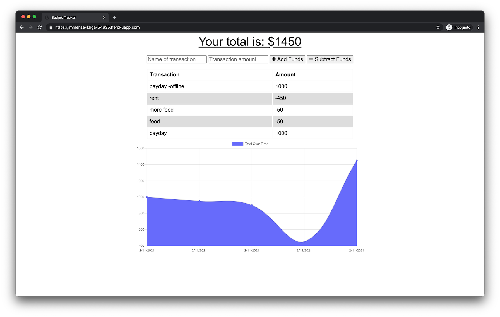

# budget tracker
[](https://opensource.org/licenses/MIT)

## Description
budget tracker is a simple app that allows you to keep track of your money flow. It's also a [progressive web app](https://developer.mozilla.org/en-US/docs/Web/Progressive_web_apps) which means it's installable and also works offline! Check out [live version](https://immense-taiga-54635.herokuapp.com/).

## Table of Contents
* [Installation](#installation)
* [Usage](#usage)
* [License](#license)
* [Contributing](#contributing)
* [Tests](#tests)
* [Questions](#questions)

## Installation
```
clone the repo to your local machine
cd into the directory and run npm install
make sure you have a local mongodb server running!
```

## Usage
```
npm start and open localhost:3000 in your favorite browser
```

## License
[MIT](https://opensource.org/licenses/MIT)

## Contributing
No contributions at this time.

## Tests
```
No tests.
```

## Questions
If you have any questions you can reach out to me on [Github](https://github.com/brhue).
